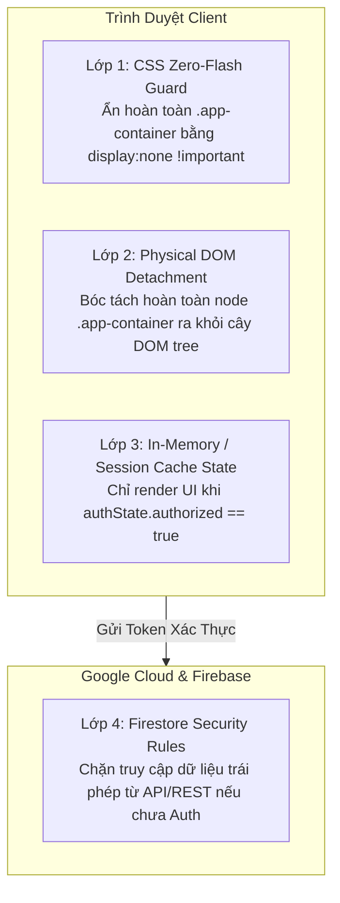
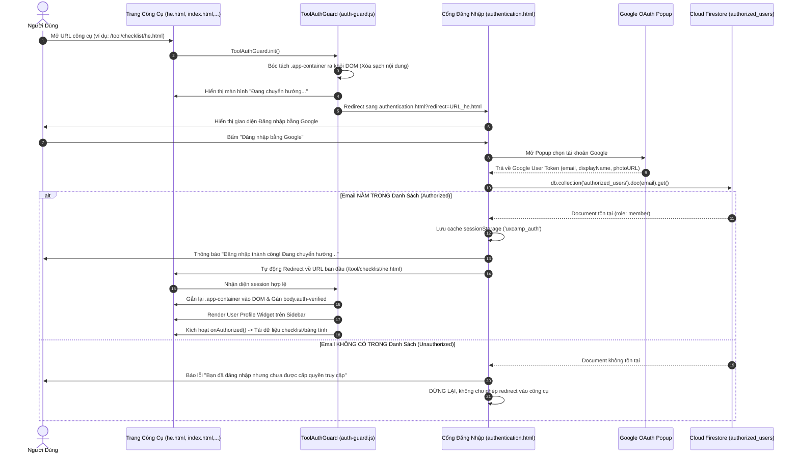

# Tài Liệu Kiến Trúc & Quy Chuẩn Nghiệp Vụ Authentication & Authorization — UXCamp Vietnam

> **Phiên bản:** 2.0 (Bảo mật 4 lớp & Cơ chế Bóc tách DOM vật lý)  
> **Áp dụng cho:** Toàn bộ công cụ và tài nguyên thuộc hệ sinh thái **UXCamp Vietnam** (bao gồm `tool/checklist`, `tool/statistic-calculator`, `tool/quiz`, `admin.html`,...).

---

## Mục Lục
1. [Tổng Quan & Triết Lý Thiết Kế](#1-tổng-quan--triết-lý-thiết-kế)
2. [Cấu Trúc Tệp Tin & Thành Phần Hệ Thống](#2-cấu-trúc-tệp-tin--thành-phần-hệ-thống)
3. [Kiến Trúc Bảo Mật 4 Lớp (Multi-Layer Defense)](#3-kiến-trúc-bảo-mật-4-lớp-multi-layer-defense)
4. [Cấu Trúc Dữ Liệu & Firestore Whitelist Schema](#4-cấu-trúc-dữ-liệu--firestore-whitelist-schema)
5. [Sơ Đồ Luồng Nghiệp Vụ Toàn Diện (Workflows)](#5-sơ-đồ-luồng-nghiệp-vụ-toàn-diện-workflows)
6. [Chi Tiết Toàn Bộ Các Use Cases & Edge Cases](#6-chi-tiết-toàn-bộ-các-use-cases--edge-cases)
7. [Hướng Dẫn Tích Hợp Cho Trang/Công Cụ Mới](#7-hướng-dẫn-tích-hợp-cho-trangcông-cụ-mới)
8. [Hướng Dẫn Dành Cho Quản Trị Viên (Admin Guide)](#8-hướng-dẫn-dành-cho-quản-trị-viên-admin-guide)

---

## 1. Tổng Quan & Triết Lý Thiết Kế

Hệ sinh thái công cụ của **UXCamp Vietnam** chứa các tài sản trí tuệ quan trọng: bộ checklist độc quyền (Heuristic, WCAG 2.2), hệ thống kiểm định thống kê chuyên sâu, nền tảng khảo thí và ngân hàng câu hỏi LMS. 

Do ứng dụng được triển khai trên nền tảng web tĩnh (Static Web Hosting - GitHub Pages), việc bảo vệ nội dung không thể chỉ dựa vào lớp phủ hiển thị (CSS Overlay) thông thường vì người dùng có thể mở **DevTools (F12) Console** để xóa overlay hoặc xem nội dung trong mã nguồn HTML.

### Nguyên Tắc Thiết Kế Cốt Lõi:
1. **Zero-Trust Content Delivery**: Nội dung công cụ (`.app-container`) **không được phép tồn tại trên cây DOM** của trình duyệt chừng nào người dùng chưa đăng nhập và chưa được xác nhận nằm trong danh sách cấp quyền.
2. **Seamless Auto-Redirect**: Người dùng chưa đăng nhập khi truy cập bất kỳ công cụ nào sẽ tự động được chuyển hướng về trang xác thực trung tâm ([authentication.html](authentication.html)) và tự động quay lại đúng công cụ sau khi đăng nhập thành công.
3. **Whitelist-based Access Control**: Chỉ tài khoản Google có email nằm trong collection Firestore `authorized_users` mới được cấp quyền xem và tương tác.
4. **Fast UI Hydration**: Sử dụng `sessionStorage` làm cache tạm thời để chuyển đổi siêu tốc giữa các trang công cụ trong cùng một phiên làm việc, đồng thời vẫn kiểm tra ngầm với Firebase server.

---

## 2. Cấu Trúc Tệp Tin & Thành Phần Hệ Thống

```
uxcampvietnam.github.io/
├── authentication.html               # Cổng đăng nhập trung tâm & hiển thị hồ sơ cá nhân
├── admin.html                        # Giao diện quản trị thêm/sửa/xóa whitelist người dùng
├── FIREBASE_SECURITY_GUIDE.md        # Hướng dẫn thiết lập Security Rules & App Check
├── AUTHENTICATION_ARCHITECTURE.md    # [Tài liệu này] Đặc tả nghiệp vụ toàn diện
│
├── script/
│   ├── authentication.js             # Logic xử lý đăng nhập Google & điều hướng tại authentication.html
│   ├── auth-guard.js                 # Module bảo vệ tập trung (Guard) tích hợp vào tất cả các Tools
│   └── libs/
│       └── svg-inject.min.js         # Thư viện biến thẻ  thành <svg> inline nhận style CSS
│
├── style/
│   ├── definition.css                # Bộ token màu sắc, typography và biến CSS toàn hệ thống
│   ├── style.css                     # Style cơ sở của UXCamp
│   └── tool-auth.css                 # Style cho Auth Gate, Loading, Unauthorized, Sidebar Widget
│
└── tool/
    ├── checklist/                    # Bộ công cụ Checklist (he.html, wcag.html,...)
    ├── statistic-calculator/         # Bộ công cụ 9 trang kiểm định thống kê
    └── quiz/                         # Hệ thống LMS & Khảo thí Quiz
```

---

## 3. Kiến Trúc Bảo Mật 4 Lớp (Multi-Layer Defense)



### Chi Tiết Từng Lớp:

| Lớp Bảo Vệ | Công Nghệ | Nhiệm Vụ & Cơ Chế Hoạt Động |
| :--- | :--- | :--- |
| **Lớp 1: CSS Zero-Flash Guard** | [style/tool-auth.css](style/tool-auth.css) | Quy tắc `body:not(.auth-verified) .app-container { display: none !important; opacity: 0 !important; }` đảm bảo nội dung không bị nhấp nháy dù chỉ 1 frame trước khi JS thực thi. |
| **Lớp 2: Physical DOM Detachment** | [script/auth-guard.js](script/auth-guard.js) | Gọi `appEl.remove()` gỡ bỏ hoàn toàn thẻ `.app-container` khỏi cây DOM. Nếu người dùng F12 xóa `<div id="tool-auth-overlay">`, trang web chỉ là thẻ `<body></body>` rỗng 100%. |
| **Lớp 3: State & Session Cache** | `sessionStorage ('uxcamp_auth')` | Quản lý trạng thái `{ uid, email, role, authorized }`. Các hàm khởi tạo ứng dụng (`startHeuristicApp()`, `initStatisticApp()`) chỉ được gọi qua callback `onAuthorized`. |
| **Lớp 4: Firestore Server Security** | Cloud Firestore Rules | Chạy 100% trên server Google, bảo vệ collection `authorized_users` và dữ liệu người dùng khỏi các request cURL/Postman giả mạo. |

---

## 4. Cấu Trúc Dữ Liệu & Firestore Whitelist Schema

### 4.1 Collection: `authorized_users`
- **Document ID:** Email người dùng dạng chữ thường (ví dụ: `designer@gmail.com`).
- **Data Model:**

```json
{
  "displayName": "Nguyễn Văn A",
  "role": "member",
  "addedAt": "2026-08-16T07:40:00.000Z",
  "addedBy": "admin@uxcamp.vn"
}
```

### 4.2 Các Vai Trò (Roles) & Phân Cấp Quyền Hạn:

| Role Key | Tên Hiển Thị | Màu Sắc Badge | Quyền Hạn Trong Hệ Thống |
| :--- | :--- | :--- | :--- |
| `admin` | **Admin** | Xanh dương (`#60a5fa`) | Toàn quyền sử dụng tools, truy cập trang quản trị [admin.html](admin.html) để thêm/xóa user. |
| `instructor` | **Giảng viên** | Tím (`#c084fc`) | Toàn quyền sử dụng checklist, statistic calculator, tạo phòng thi và quản lý lớp LMS. |
| `member` | **Thành viên** | Xanh lá (`#4ade80`) | Sử dụng toàn bộ checklist và công cụ kiểm định thống kê, làm bài thi khảo thí. |
| `alumni` | **Alumni** | Vàng Gold (`#fbbf24`) | Cựu học viên tốt nghiệp, tra cứu chứng chỉ và tài nguyên tra cứu. |

---

## 5. Sơ Đồ Luồng Nghiệp Vụ Toàn Diện (Workflows)

### 5.1 Luồng 1: Người Dùng Chưa Đăng Nhập Truy Cập Công Cụ



---

### 5.2 Luồng 2: Người Dùng Đã Đăng Nhập Nhưng Chưa Có Quyền (Direct Access)

```mermaid
flowchart TD
    A[User mở trực tiếp trang Tool khi đã login tài khoản Google lạ] --> B[ToolAuthGuard.init()]
    B --> C[Bóc tách .app-container khỏi DOM]
    B --> D[Tra cứu Firestore authorized_users]
    D -->|Doc NOT EXISTS| E[Hiển thị màn hình cảnh báo: ⛔ Không có quyền xem]
    E --> F[Hiển thị Email đang đăng nhập + Avatar]
    E --> G[Nút: Đổi tài khoản Google khác -> Đăng xuất & chuyển về authentication.html?redirect=...]
    E --> H[Nút: Đăng xuất -> Đăng xuất & chuyển về authentication.html]
    E --> I[Nút: Về trang chủ UXCamp Vietnam]
```

---

## 6. Chi Tiết Toàn Bộ Các Use Cases & Edge Cases

### Case 1: Người dùng vãng lai chưa đăng nhập
- **Hiện tượng:** Truy cập bất kỳ URL nào như `tool/checklist/wcag.html` hoặc `tool/statistic-calculator/bootstrap.html`.
- **Xử lý:**
  1. CSS lập tức ẩn toàn bộ giao diện `.app-container`.
  2. `auth-guard.js` gỡ bỏ thẻ `.app-container` khỏi DOM.
  3. Màn hình hiển thị trạng thái `Đang chuyển hướng đến trang đăng nhập...`.
  4. Trình duyệt tự động chuyển sang `authentication.html?redirect=[encodeURIComponent(URL)]`.

### Case 2: Đăng nhập thành công và có quyền trong Whitelist
- **Hiện tượng:** Người dùng đăng nhập bằng tài khoản Google đã được Admin thêm vào Firestore.
- **Xử lý:**
  1. `authentication.js` xác thực `doc.exists === true`.
  2. Lưu session vào `sessionStorage ('uxcamp_auth')`.
  3. Tự động redirect về URL trang công cụ trước đó.
  4. Trang công cụ nhận diện session, gắn lại `.app-container` vào DOM, hiển thị công cụ đầy đủ và vẽ User Profile Widget trên Sidebar.

### Case 3: Đăng nhập bằng tài khoản Google nhưng CHƯA ĐƯỢC CẤP PHÉP
- **Hiện tượng:** Người dùng đăng nhập email cá nhân chưa được Admin phê duyệt.
- **Xử lý:**
  1. Tại `authentication.html`: Báo cảnh báo màu vàng *"Bạn đã đăng nhập nhưng chưa được cấp quyền truy cập. Vui lòng liên hệ admin."* và **tuyệt đối không chuyển hướng vào công cụ**.
  2. Nếu người dùng cố tình copy paste URL công cụ: Trang công cụ bóc tách DOM, hiển thị màn hình `⛔ Không có quyền xem`, kèm nút đổi tài khoản.

### Case 4: Người dùng bấm "Đổi tài khoản khác" (Switch Account)
- **Hiện tượng:** Người dùng muốn chuyển từ email cá nhân sang email công ty/học viện có quyền.
- **Xử lý:**
  1. `ToolAuthGuard.switchAccount()` gọi `firebase.auth().signOut()`.
  2. Xóa sạch `sessionStorage ('uxcamp_auth')`.
  3. Chuyển hướng về `authentication.html?redirect=[URL_hiện_tại]`.
  4. Google Provider mở popup với tham số `prompt: 'select_account'` ép buộc Google hiển thị danh sách để người dùng chọn tài khoản mới.

### Case 5: Người dùng chuyển qua lại giữa các trang công cụ (Fast Navigation)
- **Hiện tượng:** Người dùng đang ở `one-sample-t-test.html` bấm menu chuyển sang `two-sample-t-test.html`.
- **Xử lý:**
  1. `auth-guard.js` đọc nhanh `sessionStorage ('uxcamp_auth')`.
  2. Thấy trạng thái `authorized: true`, trang lập tức unlock hiển thị công cụ mà **không bị chớp nháy hoặc phải load lại từ đầu**.
  3. Firebase `onAuthStateChanged` vẫn chạy ngầm đối soát với Firestore để đảm bảo phiên làm việc còn hiệu lực.

### Case 6: Cố tình can thiệp DevTools (F12 Console Tampering)
- **Hành vi:** Kẻ xấu mở F12, sửa CSS hoặc xóa thẻ `<div id="tool-auth-overlay">`.
- **Kết quả:** Vì `.app-container` đã bị gỡ khỏi cây DOM từ lúc khởi tạo (`protectedDOMNode`), việc xóa overlay chỉ để lại một trang trắng rỗng (`<body></body>`). Kẻ xấu hoàn toàn không xem được dữ liệu.

### Case 7: Mất kết nối mạng / Lỗi dịch vụ Firebase
- **Hiện tượng:** Mất kết nối internet khi đang xác thực hoặc Firestore trả về lỗi.
- **Xử lý:**
  1. `auth-guard.js` bắt lỗi ngoại lệ `try/catch`.
  2. Bóc tách DOM để bảo vệ nội dung.
  3. Hiển thị màn hình lỗi: `⚠️ Không thể kiểm tra trạng thái đăng nhập ([Mô tả lỗi])`.
  4. Cung cấp nút **"Thử lại"** (`window.location.reload()`) và **"Đến trang đăng nhập"**.

### Case 8: Không phân biệt chữ hoa / chữ thường trong Email (Case-Insensitive)
- **Hiện tượng:** Email đăng nhập là `User.Name@Gmail.com` trong khi database lưu `user.name@gmail.com`.
- **Xử lý:** Hàm `checkFirestoreAuthorization` tự động chuẩn hóa `.trim().toLowerCase()` khi truy vấn Document ID, đồng thời có cơ chế fallback tìm dạng nguyên bản để đảm bảo không bao giờ bị từ chối nhầm tài khoản hợp lệ.

### Case 9: Xử lý hiển thị SVG chuẩn qua `SVGInject`
- **Hiện tượng:** Logo và icon định dạng `.svg` cần nhận đúng màu sắc CSS biến của hệ thống.
- **Xử lý:** Thẻ `` logo được gắn thuộc tính `onload="SVGInject(this)"`. Thư viện `svg-inject.min.js` tự động chuyển đổi thẻ `` thành `<svg class="tool-auth-logo injected-svg">` để nhận biến màu gradient và fill từ `definition.css`.

---

## 7. Hướng Dẫn Tích Hợp Cho Trang/Công Cụ Mới

Khi tạo một trang công cụ mới (ví dụ: `tool/new-feature/index.html`), thực hiện 3 bước sau:

### Bước 1: Nạp CSS và SDK vào `<head>` của file HTML

```html
<head>
  <!-- CSS Định nghĩa hệ thống & Auth Guard -->
  <link rel="stylesheet" type="text/css" href="../../style/definition.css">
  <link rel="stylesheet" href="../../style/tool-auth.css">

  <!-- Thư viện SVGInject -->
  <script src="../../script/libs/svg-inject.min.js"></script>

  <!-- Firebase SDK (Compat) -->
  <script src="https://www.gstatic.com/firebasejs/10.12.2/firebase-app-compat.js"></script>
  <script src="https://www.gstatic.com/firebasejs/10.12.2/firebase-auth-compat.js"></script>
  <script src="https://www.gstatic.com/firebasejs/10.12.2/firebase-firestore-compat.js"></script>
  
  <!-- Tool Auth Guard Script -->
  <script src="../../script/auth-guard.js"></script>
</head>
```

### Bước 2: Bọc toàn bộ nội dung công cụ trong thẻ `.app-container`

```html
<body>
  <div class="app-container">
    <aside class="sidebar" id="sidebar">
      <div class="sidebar-content">
        <!-- Sidebar content -->
      </div>
    </aside>

    <div class="main-wrapper">
      <!-- Nội dung chính của công cụ -->
    </div>
  </div>
</body>
```

### Bước 3: Khởi tạo Guard trong JavaScript của công cụ

```javascript
function startMyNewTool() {
  console.log('Khởi chạy tính năng công cụ khi đã xác thực hợp lệ');
  // Render dữ liệu, lắng nghe sự kiện...
}

document.addEventListener('DOMContentLoaded', () => {
  if (window.ToolAuthGuard) {
    ToolAuthGuard.init({
      toolName: 'Tên Công Cụ Của Bạn',
      toolDesc: 'Mô tả ngắn gọn về công cụ.',
      sidebarSelector: '#sidebar',
      homeUrl: '../../index.html',
      authPageUrl: '../../authentication.html',
      onAuthorized: (authState) => {
        // Chỉ chạy khi đã xác thực & có quyền
        startMyNewTool();
        ToolAuthGuard.refreshSidebarWidget();
      }
    });
  } else {
    startMyNewTool();
  }
});
```

---

## 8. Hướng Dẫn Dành Cho Quản Trị Viên (Admin Guide)

### 8.1 Thêm User Mới Vào Danh Sách Được Cấp Quyền
1. Truy cập trang Quản trị: [admin.html](admin.html).
2. Đăng nhập bằng tài khoản Google có quyền `admin`.
3. Tại phần **Thêm người dùng mới**:
   - Nhập **Email Google** của học viên/thành viên (ví dụ: `student@gmail.com`).
   - Nhập **Tên hiển thị**.
   - Chọn vai trò: `Thành viên (member)` / `Giảng viên (instructor)` / `Alumni` / `Admin`.
   - Bấm **+ Thêm User**.
4. Người dùng đó ngay lập tức có thể truy cập toàn bộ các công cụ trong hệ thống.

### 8.2 Thu Hồi / Xóa Quyền Truy Cập
1. Trên trang [admin.html](admin.html), tìm email cần xóa trong bảng danh sách.
2. Bấm nút **Xóa (Delete)**.
3. Người dùng đó sẽ lập tức bị chặn ở lần truy cập hoặc làm mới trang tiếp theo.

---

> 📌 **Tài liệu tham khảo bổ sung:**  
> Xem chi tiết cấu hình bảo mật Firebase Server tại [FIREBASE_SECURITY_GUIDE.md](FIREBASE_SECURITY_GUIDE.md).
