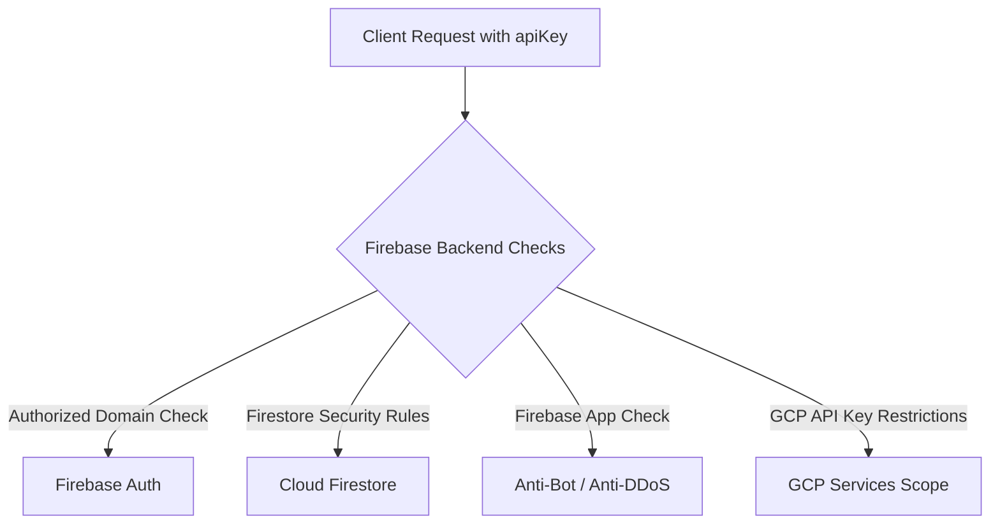

# Hướng Dẫn Bảo Mật Firebase Cho UXCamp Vietnam

Tài liệu tổng hợp các lưu ý, nguy cơ tiềm ẩn và hướng dẫn thiết lập bảo mật chi tiết khi sử dụng **Firebase Authentication** và **Cloud Firestore** trên ứng dụng web client-side.

---

## 1. Bản Chất của `firebaseConfig` và `apiKey`

Trong kiến trúc Firebase Client SDK (Web/Mobile):
* Các thông số trong `firebaseConfig` (`apiKey`, `authDomain`, `projectId`, `appId`,... trong file [authentication.js](script/authentication.js)) **bắt buộc phải chạy trên trình duyệt** nên người dùng mở DevTools (F12) sẽ luôn nhìn thấy.
* **`apiKey` của Firebase không phải là Secret Key / Admin Token**. Nó chỉ đóng vai trò là **Mã định danh dự án (Project Identifier)** để định tuyến request về đúng Firebase project của bạn.
* Bảo mật của Firebase **không phụ thuộc vào việc giấu API key**, mà phụ thuộc vào **Quy tắc bảo mật trên server (Security Rules & Service Restrictions)**.

---

## 2. Các Rủi Ro Tiềm Ẩn & Giải Pháp Phòng Chống



### 🔴 Rủi ro 1: Bị đọc, sửa, xóa trái phép dữ liệu Firestore (Quan trọng nhất)
* **Nguy cơ:** Kẻ xấu lấy `projectId` và `apiKey` để gửi request trực tiếp đến Firestore REST API. Nếu Security Rules chưa bật hoặc để mở (`allow read, write: if true;`), database sẽ bị đánh cắp hoặc xóa sạch.
* **Giải pháp:** Thiết lập **Firestore Security Rules** nghiêm ngặt trên Firebase Console.

#### 🛡️ Cấu hình Firestore Security Rules mẫu cho dự án:
Vào **Firebase Console** → **Firestore Database** → tab **Rules** và dán cấu hình sau:

```javascript
rules_version = '2';
service cloud.firestore {
  match /databases/{database}/documents {
    
    // Collection 'authorized_users'
    match /authorized_users/{email} {
      allow read: if request.auth != null;
      allow write: if false;
    }

    // Collection 'classes' (Quản lý Lớp học BCNF)
    match /classes/{classId} {
      allow read: if request.auth != null;
      allow create, update, delete: if request.auth != null;
    }

    // Collection 'class_enrollments' (Ghi danh học viên & tiến độ)
    match /class_enrollments/{enrollmentId} {
      allow read: if request.auth != null;
      allow create, update, delete: if request.auth != null;
    }

    // Collection 'class_quizzes' (Chương trình quiz của lớp)
    match /class_quizzes/{classQuizId} {
      allow read: if request.auth != null;
      allow create, update, delete: if request.auth != null;
    }

    // Collection 'certificates' (Chứng chỉ tốt nghiệp số)
    match /certificates/{certificateId} {
      allow read: if true; // Công khai để tra cứu và quét mã QR xác thực
      allow create, update: if request.auth != null;
    }

    // Collection 'quiz_banks' (Kho bộ câu hỏi)
    match /quiz_banks/{quizId} {
      allow read: if request.auth != null;
      allow create, update: if request.auth != null;
      allow delete: if request.auth != null && (resource.data.createdBy == request.auth.token.email.lower());
    }

    // Collection 'quiz_rooms' (Quản lý phiên thi trực tiếp)
    match /quiz_rooms/{roomCode} {
      allow read: if request.auth != null;
      allow create, update, delete: if request.auth != null;
    }

    // Collection 'quiz_submissions' (Bài nộp & kết quả làm bài)
    match /quiz_submissions/{subId} {
      allow read: if request.auth != null;
      allow create, update: if request.auth != null;
    }
    
    // Khóa toàn bộ các collection khác nếu có
    match /{document=**} {
      allow read, write: if false;
    }
  }
}
```

---

### 🔴 Rủi ro 2: Bị spam request, DDoS làm cạn kiệt Quota hoặc phát sinh chi phí
* **Nguy cơ:** Kẻ xấu viết bot/script tự động gọi liên tục vào Firebase Auth/Firestore để làm nghẽn hệ thống hoặc gây tốn chi phí.
* **Giải pháp:**
  1. **Kích hoạt Firebase App Check:**
     * Vào **Firebase Console** → **App Check**.
     * Đăng ký provider **reCAPTCHA Enterprise** hoặc **reCAPTCHA v3** cho web app.
     * Bật tính năng Enforce cho Firestore & Auth. Khi đó, chỉ các request gửi từ website chính chủ mới được chấp nhận; các request từ cURL, Postman hay botnet sẽ bị chặn ngay từ cổng vào.
  2. **Cài đặt Cảnh báo Ngân sách & Hạn mức (Budget Alerts):**
     * Truy cập [Google Cloud Billing](https://console.cloud.google.com/billing).
     * Thiết lập cảnh báo ngân sách (ví dụ: gửi email khi chi phí chạm mốc $1, $5, $10...).
     * Thiết lập Quota Limit trên Firestore để tự động ngắt khi vượt ngưỡng an toàn.

---

### 🔴 Rủi ro 3: Bị nhúng config vào website lạ để lạm dụng Đăng nhập Google
* **Nguy cơ:** Website khác lấy `firebaseConfig` của bạn để tạo popup đăng nhập Google với tên thương hiệu của bạn.
* **Giải pháp:**
  * Vào **Firebase Console** → **Authentication** → **Settings** → **Authorized domains**.
  * **Chỉ giữ lại các domain hợp lệ của dự án**, ví dụ:
    * `uxcampvietnam.github.io`
    * Tên miền riêng (nếu có, ví dụ: `uxcamp.vn`)
    * `localhost` (chỉ dùng khi phát triển cục bộ)
  * Xóa bỏ các domain không sử dụng. Firebase Auth sẽ từ chối mở popup / redirect OAuth từ mọi domain không có trong danh sách này.

---

### 🔴 Rủi ro 4: Bị lợi dụng API key để gọi sang các dịch vụ Google Cloud khác
* **Nguy cơ:** Mặc định API key có thể gọi được nhiều API khác trên Google Cloud nếu chưa giới hạn phạm vi.
* **Giải pháp:**
  1. Truy cập [Google Cloud Console - Credentials](https://console.cloud.google.com/apis/credentials).
  2. Chọn API key của ứng dụng (thường có tên *Browser key* hoặc *Auto-created by Firebase*).
  3. Tại mục **API restrictions**:
     * Chọn **Restrict key**.
     * Chỉ tích chọn các dịch vụ dự án đang sử dụng:
       * `Firebase Authentication API`
       * `Cloud Firestore API`
       * `Identity Toolkit API`
       * `Token Service API`
  4. Bấm **Save**.

---

## 3. Lưu Ý Về Code Client-Side Trong Dự Án

Trong file [authentication.js](script/authentication.js):

| Vị trí code | Vai trò thực tế | Lưu ý an toàn |
| :--- | :--- | :--- |
| `UXCampAuth.requireAuth()` | **UX / Điều hướng giao diện** | Giúp chuyển trang mượt mà cho người dùng thông thường. |
| `sessionStorage.getItem('uxcamp_auth')` | **Cache trạng thái hiển thị UI** | Không được coi là cơ chế bảo mật tuyệt đối vì người dùng có thể can thiệp DevTools console để sửa `sessionStorage`. |
| `Firestore Security Rules` | **Lớp bảo mật cốt lõi (Core Security)** | Chạy 100% trên server Google, bảo vệ dữ liệu thực tế khỏi mọi sự can thiệp từ client. |

---

## 4. Checklist Triển Khai Nhanh

- [ ] Cập nhật **Firestore Security Rules** trên Firebase Console (chặn write, chỉ cho phép read đúng email).
- [ ] Rà soát danh sách **Authorized Domains** trong Firebase Auth (chỉ giữ `uxcampvietnam.github.io` & `localhost`).
- [ ] Giới hạn **API Restrictions** cho Google API Key trên Google Cloud Console.
- [ ] Cấu hình **Budget Alerts** trên Google Cloud Billing để theo dõi chi phí.
- [ ] (Nâng cao) Bật **Firebase App Check** với reCAPTCHA Enterprise để chống spam/bot.
