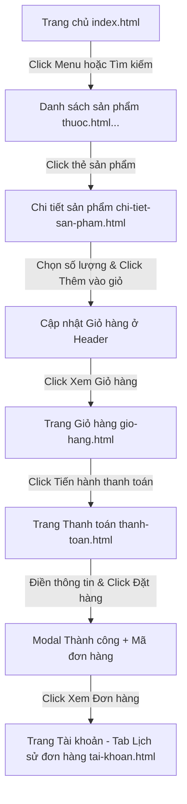
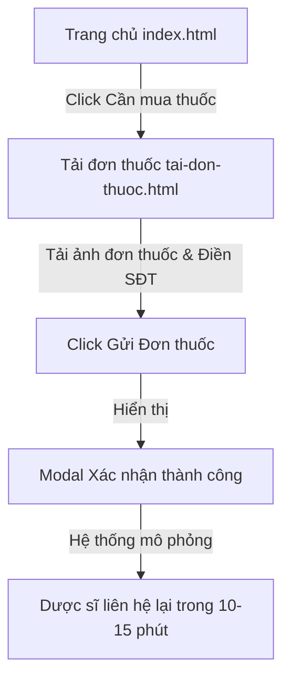

# Cấu Trúc Website Nhà Thuốc Hay (Wireframe Prototype)

Tài liệu này mô tả chi tiết danh sách các màn hình (trang), thông tin hiển thị trên từng màn hình và các luồng nghiệp vụ chính của website **Nhà Thuốc Hay**.

---

## 1. Danh Sách Màn Hình (Screens)

Website sử dụng phong cách thiết kế wireframe dạng sơ đồ khung xương (Grayscale & Outlines), tập trung vào phân bổ luồng thông tin, cấu trúc trang và trải nghiệm tương tác.

### 1.1. Trang Chủ (`index.html`)
*   **Mục đích**: Điểm chạm đầu tiên của khách hàng, điều hướng đến các nhu cầu cốt lõi.
*   **Thông tin hiển thị**:
    *   **Thanh điều hướng chung (Header)**: Logo, Ô tìm kiếm đa năng, Bộ chọn Tỉnh/Thành, Nút "Cần mua thuốc" (tải đơn thuốc), Nút "Giỏ hàng" (có badge số lượng), Nút "Tài khoản" (Trang cá nhân).
    *   **Menu Danh mục**: Thuốc, Thực phẩm chức năng, Dược mỹ phẩm, Chăm sóc cá nhân & Thiết bị y tế, Tư vấn bác sĩ, Góc sức khỏe, Hệ thống nhà thuốc.
    *   **Banner Quảng cáo (Carousel)**: Banner khuyến mãi, giới thiệu dịch vụ.
    *   **Lối tắt nhanh (Quick Actions)**:
        *   *Cần mua thuốc* (Tải đơn thuốc)
        *   *Tư vấn Dược sĩ* (Trực tuyến)
        *   *Đơn của tôi* (Xem lịch sử mua)
        *   *Tìm nhà thuốc* (Định vị cửa hàng)
        *   *Tra thuốc chính hãng* (Kiểm tra nguồn gốc)
    *   **Khu vực Nội dung động**:
        *   *Hot Deals / Khuyến mãi chớp nhoáng*: Danh sách sản phẩm giảm giá mạnh.
        *   *Bệnh theo mùa*: Các thuốc/TPCN đề xuất cho thời tiết hiện tại.
        *   *Kiểm tra sức khỏe trực tuyến (Health Quiz)*: Trắc nghiệm nhanh để nhận đề xuất.
        *   *Bệnh theo đối tượng*: Bộ lọc sản phẩm cho Người già, Trẻ em, Phụ nữ mang thai.
        *   *Góc sức khỏe*: Các bài báo y khoa, lời khuyên sức khỏe mới nhất.
    *   **Chân trang (Footer)**: Giới thiệu, chính sách, tra cứu nhanh, hotline, liên kết tải app.

### 1.2. Màn Hình Danh Mục Sản Phẩm (`thuoc.html`, `thuc-pham-chuc-nang.html`, `duoc-my-pham.html`, `cham-soc-ca-nhan-thiet-bi-y-te.html`)
*   **Mục đích**: Nơi người dùng duyệt qua danh sách sản phẩm thuộc từng ngành hàng lớn.
*   **Thông tin hiển thị**:
    *   **Đường dẫn thư mục (Breadcrumbs)**: Trang chủ > [Tên danh mục].
    *   **Bộ lọc phân loại sản phẩm (Accordion Tree Sidebar)**:
        *   Thiết kế dạng cây phân cấp (Cấp 1 & Cấp 2) lấy từ dữ liệu Master Data.
        *   Hành vi Accordion: Click vào danh mục Cấp 1 sẽ mở rộng danh sách Cấp 2 tương ứng bên dưới và tự động thu gọn các nhánh Cấp 1 khác.
        *   Người dùng có thể click chọn Cấp 1 để xem toàn bộ sản phẩm thuộc nhóm này, hoặc click sâu hơn vào Cấp 2 để lọc chi tiết.
        *   Đường gạch dọc màu xanh chỉ định trực quan danh mục Cấp 2 đang hoạt động.
    *   **Bộ lọc phụ trợ**: 
        *   *Trạng thái kho*: Checkbox lọc sản phẩm "Còn hàng".
        *   *Sắp xếp*: Menu thả xuống để xếp theo Mặc định, Giá tăng dần, Giá giảm dần, hoặc Đánh giá tốt nhất.
    *   **Danh sách sản phẩm (Grid)**: Các thẻ sản phẩm hiển thị:
        *   Ảnh sản phẩm (khung wireframe).
        *   Nhãn đỏ "Kê đơn" (đối với thuốc kê đơn ETC).
        *   Tên sản phẩm (lấy chính xác từ file Master Data).
        *   Quy cách đóng gói, Điểm đánh giá sao & số lượng đã bán.
        *   Giá bán hiện hành & Giá gốc (nếu có giảm giá).
        *   Nút "Thêm" (đưa vào giỏ hàng và giữ nguyên trang) và "Mua ngay" (đưa vào giỏ và chuyển đến trang giỏ hàng).

### 1.3. Chi Tiết Sản Phẩm (`chi-tiet-san-pham.html`)
*   **Mục đích**: Cung cấp thông tin chi tiết nhất về một sản phẩm cụ thể.
*   **Thông tin hiển thị**:
    *   **Thông tin mua hàng chính**:
        *   Hình ảnh sản phẩm (có nút zoom/slide ảnh).
        *   Tên sản phẩm, Thương hiệu, Nước sản xuất, Số đăng ký (SĐK).
        *   Trạng thái kho hàng (Còn hàng / Hết hàng).
        *   Giá bán hiện tại & Giá gốc trước đây.
        *   Bộ chọn số lượng (tăng/giảm).
        *   Nút hành động: "Thêm vào giỏ hàng" hoặc "Mua ngay".
        *   Cảnh báo quan trọng đối với thuốc kê đơn: *Yêu cầu đơn thuốc của bác sĩ*.
    *   **Thông tin chi tiết (Tabs)**:
        *   *Mô tả*: Thông tin chung về công dụng, đối tượng sử dụng.
        *   *Thành phần*: Danh sách dược chất, nồng độ/hàm lượng.
        *   *Cách dùng & Liều dùng*: Hướng dẫn chi tiết.
        *   *Tác dụng phụ / Lưu ý*: Cảnh báo khi sử dụng.
        *   *Đánh giá của khách hàng*: Điểm đánh giá trung bình & danh sách bình luận mẫu.

### 1.4. Giỏ Hàng (`gio-hang.html`)
*   **Mục đích**: Xem lại các sản phẩm đã chọn, điều chỉnh số lượng trước khi đặt hàng.
*   **Thông tin hiển thị**:
    *   Danh sách sản phẩm trong giỏ: Tên, quy cách, đơn giá, số lượng (cho phép thay đổi trực tiếp), thành tiền và nút xóa.
    *   Mã giảm giá (Promo Code): Ô nhập mã và nút áp dụng.
    *   Bảng tóm tắt chi phí: Tạm tính, Giảm giá, Thuế VAT, Phí vận chuyển, Tổng thanh toán.
    *   Nút "Tiến hành thanh toán".

### 1.5. Đặt Hàng & Thanh Toán (`thanh-toan.html`)
*   **Mục đích**: Thu thập thông tin giao nhận và lựa chọn phương thức thanh toán.
*   **Thông tin hiển thị**:
    *   **Thông tin người nhận**: Họ tên, Số điện thoại, Địa chỉ giao hàng (Tỉnh/Thành, Quận/Huyện, Xã/Phường, số nhà).
    *   **Yêu cầu xuất hóa đơn đỏ (VAT)**: Ô nhập tên công ty, mã số thuế, địa chỉ hóa đơn.
    *   **Phương thức giao hàng**: Giao nhanh (2h), Giao tiêu chuẩn.
    *   **Phương thức thanh toán**: Tiền mặt khi nhận hàng (COD), Chuyển khoản ngân hàng, Quét mã QR, Ví điện tử.
    *   **Tóm tắt đơn hàng (Sidebar)**: Danh sách rút gọn sản phẩm, tổng tiền.
    *   Nút "Xác nhận đặt hàng" -> Hiển thị Modal thông báo thành công kèm mã đơn hàng.

### 1.6. Tải Đơn Thuốc (`tai-don-thuoc.html`)
*   **Mục đích**: Người dùng có đơn thuốc giấy/file ảnh muốn gửi cho dược sĩ để được tư vấn và soạn thuốc hộ.
*   **Thông tin hiển thị**:
    *   Khu vực tải lên (Drag & Drop): Hỗ trợ kéo thả file ảnh đơn thuốc hoặc file PDF.
    *   Form thông tin liên hệ: Họ tên, Số điện thoại di động, Địa chỉ giao hàng mong muốn, Ghi chú cho Dược sĩ.
    *   Nút "Gửi đơn thuốc" -> Hiển thị thông báo Dược sĩ sẽ gọi lại tư vấn trong vòng 10-15 phút.

### 1.7. Tư Vấn Dược Sĩ / Bác Sĩ Trực Tuyến (`tu-van-bac-si.html`)
*   **Mục đích**: Kết nối tư vấn y khoa và hỗ trợ mua hàng.
*   **Thông tin hiển thị**:
    *   **Đặt lịch khám/tư vấn**: Danh sách chuyên gia (Nhi khoa, Da liễu, Dinh dưỡng, Tai mũi họng...), đặt lịch hẹn theo khung giờ.
    *   **Khung chat tương tác (Interactive Chat UI)**: Cho phép trò chuyện trực tiếp với Dược sĩ trực ban. Khách hàng nhập tin nhắn và nhận phản hồi tự động thông minh mô phỏng dược sĩ hỗ trợ tư vấn liều dùng.

### 1.8. Hệ Thống Nhà Thuốc (`he-thong-nha-thuoc.html`)
*   **Mục đích**: Tìm cửa hàng vật lý gần nhất.
*   **Thông tin hiển thị**:
    *   Bộ lọc vị trí: Chọn Tỉnh/Thành phố -> Chọn Quận/Huyện.
    *   Danh sách cửa hàng kết quả: Địa chỉ chi tiết, hotline liên hệ, giờ mở cửa, đường dẫn bản đồ (Google Maps link).
    *   Bản đồ định vị wireframe (khung mô phỏng bản đồ).

### 1.9. Góc Sức Khỏe (`goc-suc-khoe.html` & `goc-suc-khoe-detail.html`)
*   **Mục đích**: Cung cấp kiến thức y khoa chuẩn xác, gia tăng tương tác và hỗ trợ SEO.
*   **Thông tin hiển thị**:
    *   Danh mục bài viết: Tin tức y khoa, Bệnh học, Dinh dưỡng, Mẹo sống khỏe.
    *   Bài viết nổi bật (Featured): Bài viết lớn có ảnh đại diện, tóm tắt.
    *   Trang chi tiết bài viết: Tiêu đề lớn, tác giả (Bác sĩ chuyên khoa), ngày đăng, nội dung chi tiết bài viết, các sản phẩm đề xuất liên quan đến bệnh học đó (ví dụ bài viết dạ dày sẽ đề xuất thuốc dạ dày ở chân trang).

### 1.10. Quản Lý Tài Khoản Cá Nhân (`tai-khoan.html`)
*   **Mục đích**: Nơi người dùng quản lý hồ sơ, đơn hàng và các thông tin tích lũy.
*   **Thông tin hiển thị**:
    *   **Bảng điều khiển (Sidebar)**: Các menu tab chuyển đổi động:
        1.  *Thông tin chung*: Họ tên, ngày sinh, giới tính, email, số điện thoại.
        2.  *Đổi mật khẩu*: Nhập mật khẩu cũ, mật khẩu mới, xác nhận.
        3.  *Địa chỉ giao hàng*: Danh sách các địa chỉ đã lưu, nút thêm địa chỉ mới.
        4.  *Thông tin xuất hóa đơn*: Danh sách các công ty đã lưu MST.
        5.  *Tài khoản ngân hàng*: Thông tin thẻ để thanh toán nhanh.
        6.  *Danh sách đơn hàng*: Các đơn hàng đã mua, trạng thái (Chờ duyệt, Đang giao, Đã giao, Đã hủy). Click xem chi tiết đơn hàng.
        7.  *Điểm tích lũy*: Số điểm hiện có, lịch sử cộng/trừ điểm thành viên.
        8.  *Thống kê chi tiêu*: Biểu đồ/bảng số liệu thống kê tiền thuốc đã chi tiêu theo tháng.
        9.  *Sản phẩm yêu thích*: Danh sách các mặt hàng khách hàng đã lưu, có nút thêm nhanh vào giỏ.

### 1.11. Cổng Tra Cứu và Tìm Kiếm (`tra-cuu.html`)
*   **Mục đích**: Tìm kiếm tổng hợp, kiểm tra trạng thái đơn hàng, xác thực xuất xứ thuốc và tra cứu hoạt chất y khoa.
*   **Thông tin hiển thị**:
    *   Giao diện gồm 4 tab điều động:
        1.  *Kết quả tìm kiếm*: Hiển thị danh sách sản phẩm và bài viết liên quan theo từ khóa nhập từ ô tìm kiếm Header.
        2.  *Tra cứu đơn hàng*: Nhập mã đơn hàng bất kỳ (ví dụ: `NT-999` hoặc mã đơn từ trang thanh toán) -> Hiển thị sơ đồ Timeline tiến độ đóng gói và giao nhận.
        3.  *Tra thuốc chính hãng*: Nhập Số đăng ký thuốc (ví dụ: `VN-19225-15`) -> Xác thực nguồn gốc y tế, nhà sản xuất, nước sản xuất.
        4.  *🧪 Tra cứu dược chất*: Danh mục các hoạt chất phổ biến (Paracetamol, Ibuprofen, Rabeprazole, Cefuroxime, Omeprazole). Khi nhấp chọn hoạt chất, hiển thị mô tả công dụng y khoa chi tiết và các sản phẩm gợi ý có chứa hoạt chất đó kèm nút "Thêm nhanh" vào giỏ hàng.

---

## 2. Các Luồng Nghiệp Vụ Chính (Business Flows)

Dưới đây là sơ đồ mô tả luồng di chuyển của người dùng trên prototype để thực hiện các hành động thực tế.

### Luồng 1: Mua Sắm E-commerce chuẩn (Mua OTC/Mỹ phẩm/TPCN)

### Luồng 2: Tải Đơn Thuốc Tìm Thuốc (Bán ETC kê đơn)

### Luồng 3: Tư Vấn Với Dược Sĩ Trực Tuyến
*   **Cách 1 (Toàn trang)**: Người dùng vào `tu-van-bac-si.html` -> Chọn Dược sĩ trực tuyến -> Nhập câu hỏi -> Dược sĩ trả lời tự động dựa trên từ khóa y khoa.
*   **Cách 2 (Mọi trang - Widget nổi)**: Nhấp vào biểu tượng Chat Bong Bóng góc dưới bên phải -> Bảng chat mở ra -> Chọn chủ đề cần tư vấn (Mua thuốc, Hỏi bệnh học, Khiếu nại đơn hàng) -> Nhập tin nhắn nhận phản hồi ngay lập tức.

### Luồng 4: Tra Cứu Trạng Thái Đơn Hàng & Thuốc Chính Hãng
*   Người dùng click vào liên kết "Tra cứu đơn hàng" hoặc "Tra thuốc chính hãng" trên trang chủ/chân trang.
*   Hệ thống chuyển hướng sang `tra-cuu.html`.
*   **Tra cứu đơn hàng**: Nhập mã đơn hàng bất kỳ (Ví dụ: `NT-999`) -> Hệ thống hiển thị lịch trình giao nhận: *Đã tiếp nhận đơn hàng* -> *Đang đóng gói tại kho Hà Nội* -> *Dược sĩ giao hàng đang di chuyển*.
*   **Tra cứu nguồn gốc thuốc**: Nhập Số đăng ký (Ví dụ: `VN-19225-15`) -> Hệ thống hiển thị: *Thuốc chính hãng sản xuất bởi Abbott Laboratories, nhập khẩu chính ngạch*.
